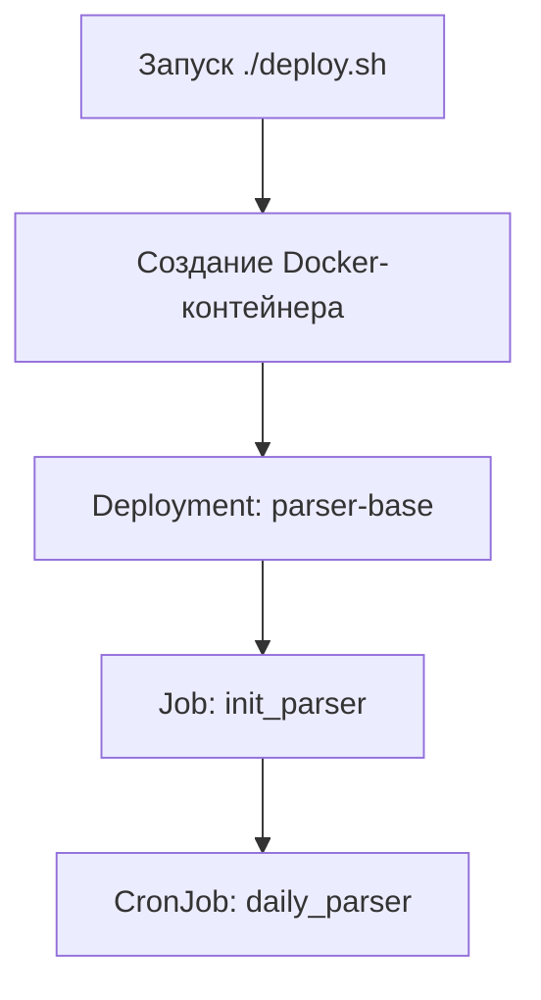
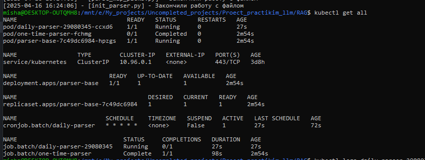
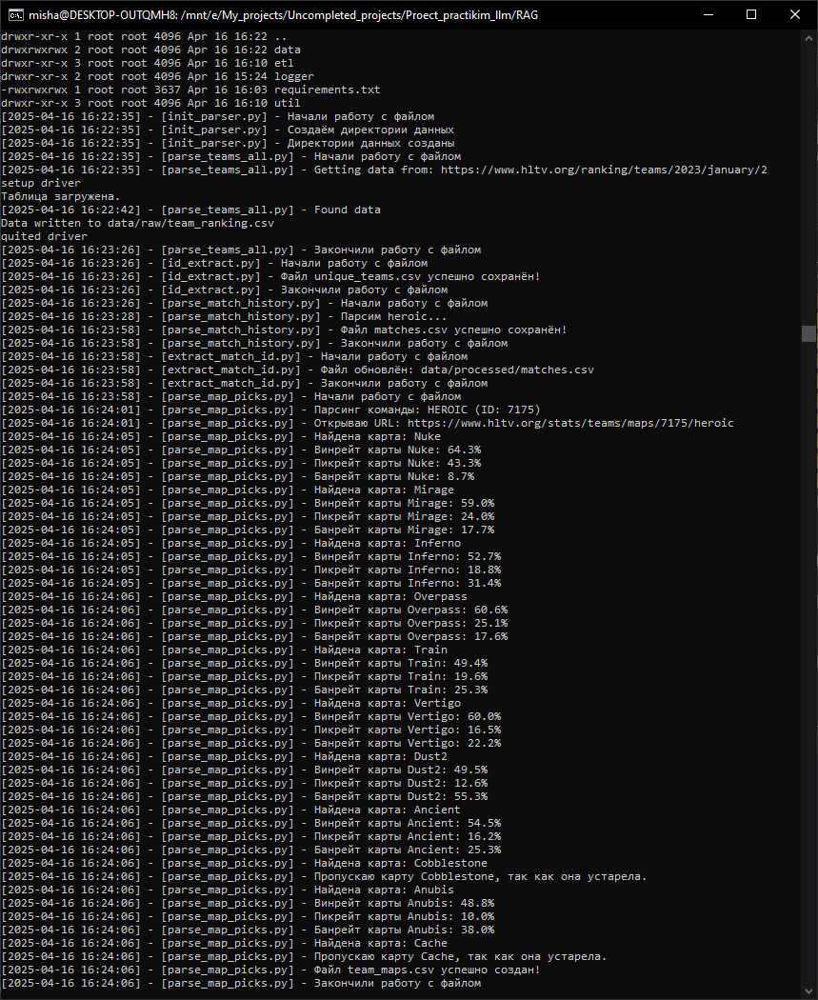
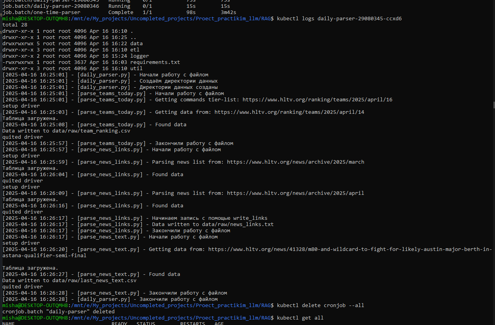

# 🚀 RAG Project

Проект по выкачианию бабла из людей теперь в Kubernetes!

---

## 📦 Что потребуется для запуска

Перед началом убедитесь, что установлены:

- [Minikube](https://minikube.sigs.k8s.io/docs/start/)
- [kubectl](https://kubernetes.io/docs/tasks/tools/)

> 🔍 Для установки можно воспользоваться официальными инструкциями или просто "погуглить".

---

## ⚙️ Запуск Minikube

В зависимости от вашей ОС:

- **WSL / Windows**:
  ```bash
  minikube start --driver=docker
  ```

- **Linux**:
  ```bash
  minikube start
  ```

---

## 🧪 Режим тестирования

В скриптах `init_parser` и `daily_parser` есть переменная `TEST_MODE`, которая:

- Ограничивает парсинг одним элементом
- Автоматически вставляет ссылки для теста

---

## 🚀 Деплой проекта

Для запуска проекта используйте:

```bash
./deploy.sh
```

Что произойдёт:

- Создастся Docker-контейнер, в который загрузится весь проект
- Запустится `Deployment` с базовым парсером `parser-base`
- Запустится `Job`, выполняющий `init_parser`
- После выполнения `Job`, по расписанию активируется `CronJob`, запускающий `daily_parser`

> 🕒 Расписание можно посмотреть/изменить в `k8s/cronjob.yaml`. Для теста используется `* * * * *` — каждый запуск каждую минуту.

---

## 🔧 Работа с Kubernetes

- Посмотреть все объекты:
  ```bash
  kubectl get all
  ```

- Посмотреть логи конкретного Pod-а:
  ```bash
  kubectl logs <pod-name>
  ```

- Зайти внутрь Pod-а:
  ```bash
  kubectl exec -it <pod-name> -- bash
  ```

> ⚠️ Если используете Python внутри Pod-а, выходите через `exit()`.  
> Иначе — перед выходом обязательно выполните (ну ил хрен его знает, что делать):
> ```bash
> jobs
> kill $<number-of-job>
> ```

---

## 🗺️ Структура проекта

Для лучшего понимания, вот краткая архитектура процессов:



> *Mermaid-диаграмма должна отображаться автоматически на GitHub, иначе delete*

---

## 🗃️ Структура репозитория

```
RAG/
├── util/
├── etl/
│   ├── init_parser.py  # однократный парсер
│   ├── daily_parser.py    # ежедневный парсер
├── data/
│   └── *.csv                # база данных в csv
├── logger/
│   └── logger.py            # код для логов
├── Dockerfile
├── k8s/
│   ├── deployment.yaml
│   ├── cronjob.yaml
│   ├── persistent-volume.yaml  # внешняя база данных
│   └── job.yaml
├── deploy.sh              # Скрипт деплоя
└── README.md
```

---

## 🖼️ Примеры логов и скриншоты

### 🔍 Пример: `kubectl get all`

> 

### 📄 Пример: Логи init_parser

> 

### 📄 Пример: Логи daily_parser

> 

### 💻 Пример: Вход внутрь pod-а

> 

---

